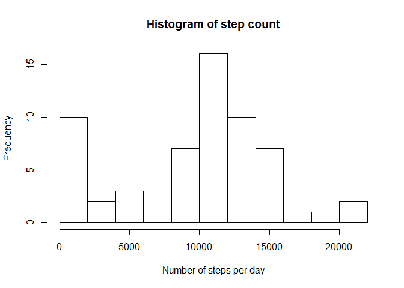
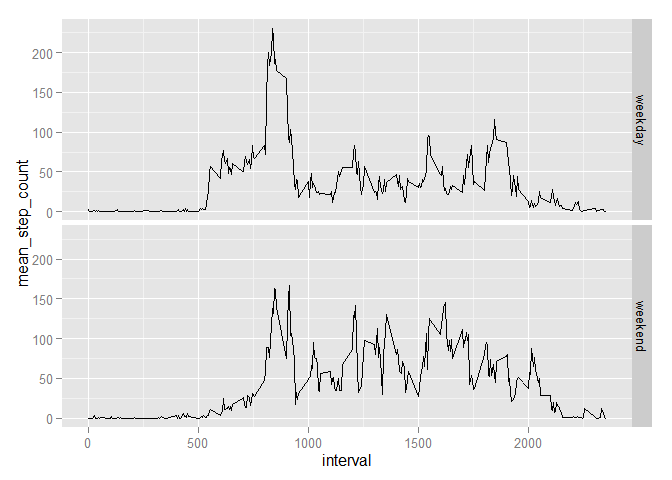

# Reproducible Research: Peer Assessment 1
Gunnar Gunnarsson  


## Loading and preprocessing the data
Read in the data. Only preprocessing made is mapping the *date* column to the 
data type date. We also add the libraries needed for the analysis that follows.

```r
d=read.csv("activity.csv")
d$date=as.Date(d$date)
```


```r
library(dplyr)
```

```
## 
## Attaching package: 'dplyr'
## 
## The following objects are masked from 'package:stats':
## 
##     filter, lag
## 
## The following objects are masked from 'package:base':
## 
##     intersect, setdiff, setequal, union
```

```r
library(ggplot2)
```


## What is mean total number of steps taken per day?

We group the data by day and show some statistics and graphicalculate the average number of steps per day

```r
steps_per_day=(d %>% group_by(date) %>% 
                  summarise(total_nb_steps=sum(steps,na.rm=T)))
hist(steps_per_day$total_nb_steps, 15,
     xlab="Number of steps per day",
     main="Histogram of step count")
```

 

```r
mean(steps_per_day$total_nb_steps,na.rm=T)
```

```
## [1] 9354.23
```

```r
median(steps_per_day$total_nb_steps,na.rm=T)
```

```
## [1] 10395
```

## What is the average daily activity pattern?

```r
steps_per_interval=(d %>% group_by(interval) %>%
                        summarise(mean_step_count=mean(steps,na.rm=T)))
plot(steps_per_interval$interval,steps_per_interval$mean_step_count,type="l")
```

 

```r
steps_per_interval$interval[which.max(steps_per_interval$mean_step_count)]
```

```
## [1] 835
```

## Imputing missing values
We calculate the number of missing data points.


```r
sum(is.na(d$steps))
```

```
## [1] 2304
```

We replace the missing values with the average number of steps
for the given time interval

```r
d_noNA=d
interval_index=sapply(d$interval,function(i) which(steps_per_interval$interval==i))
d_noNA$steps=ifelse(is.na(d$steps),steps_per_interval$mean_step_count[interval_index],d$steps)
```

We then do the same calculation and graphing as above with no missing values

```r
steps_per_day_noNA=(d_noNA %>% group_by(date) %>% 
                  summarise(total_nb_steps=sum(steps)))
hist(steps_per_day_noNA$total_nb_steps, 15,
     xlab="Number of steps per day",
     main="Histogram of step count, NAs imputed")
```

 

```r
mean(steps_per_day_noNA$total_nb_steps)
```

```
## [1] 10766.19
```

```r
median(steps_per_day_noNA$total_nb_steps)
```

```
## [1] 10766.19
```

Imputing the missing values increases the mean number of steps but has little effect on the median value. The imputation of missing values increases the estimate for total daily number of steps.

## Are there differences in activity patterns between weekdays and weekends?
We now examine the difference between weekdays and weekends.

This is run with locale set to Icelandic so the weekend days are *laugardagur* and *sunnudagur* which are the Icelandic terms for *Saturday* and *Sunday* respectively.


```r
d_noNA$typeofday=as.factor(ifelse(weekdays(d_noNA$date)%in%c("laugardagur","sunnudagur"),"weekend","weekday"))
steps_per_interval_noNA_bytype=(d_noNA %>% group_by(interval,typeofday) %>%
                        summarise(mean_step_count=mean(steps,na.rm=T)))


p=ggplot(steps_per_interval_noNA_bytype,aes(x=interval,y=mean_step_count))+
    geom_line()+facet_grid(typeofday~.)

plot(p)
```

 

